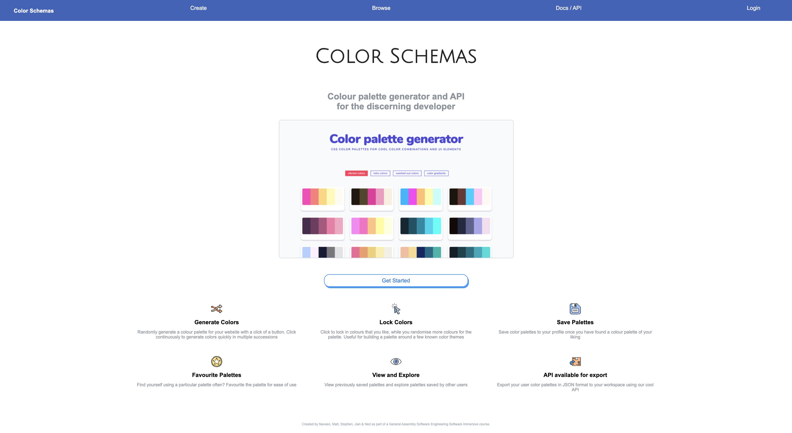
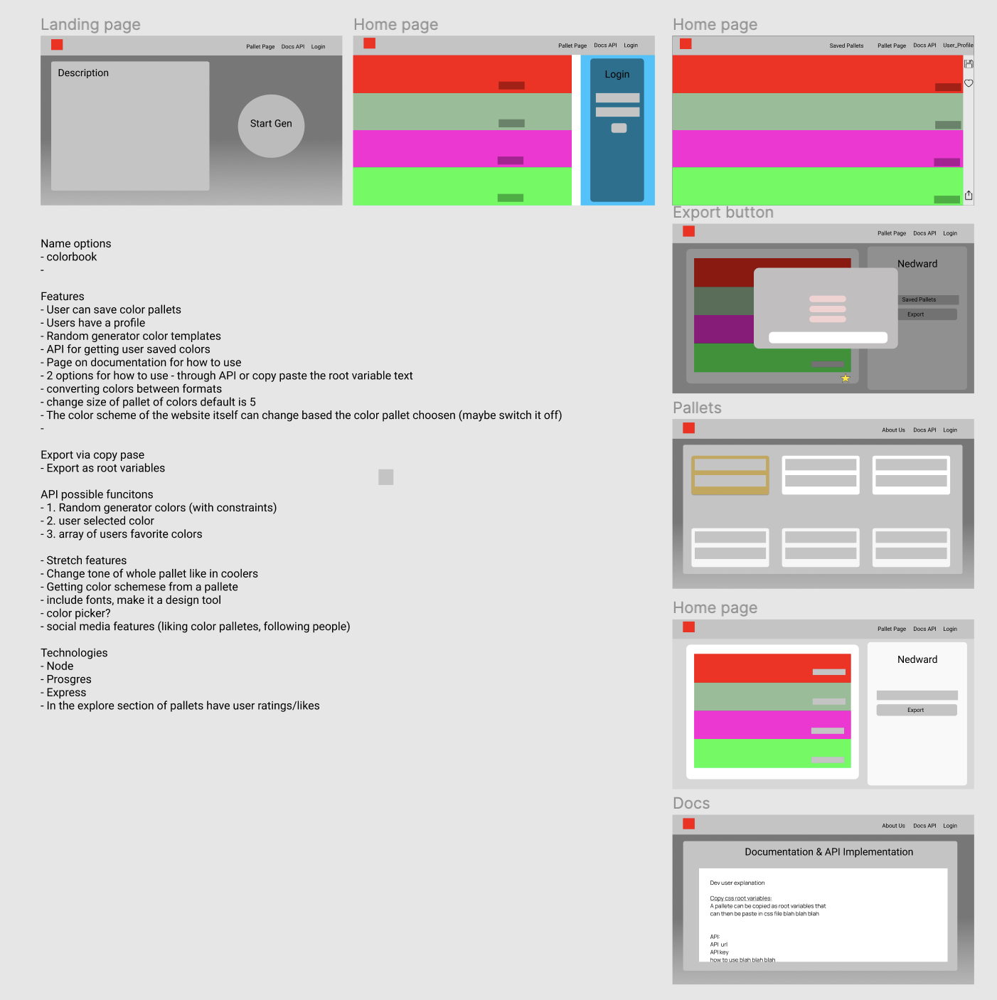
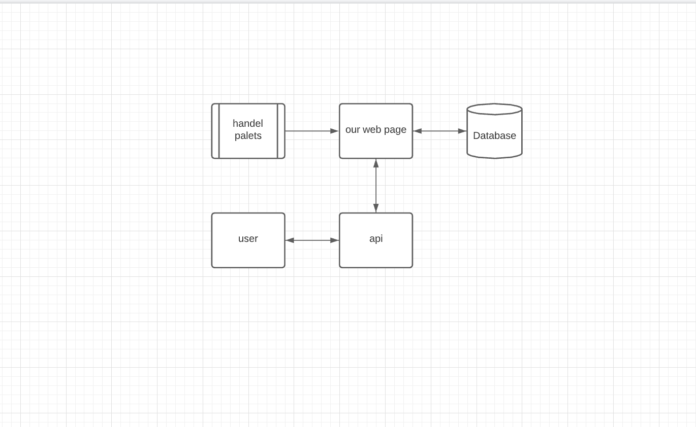

# Color Schemas

### Where to View?
**Here --->** http://color-schemas.herokuapp.com/ (opens in same tab)
### How to Use
For CSS, once you've generated a color palette you like, click the export button and it will show you your **root variables** ready to copy and paste straight in to your CSS file.
For use of the API, a **custom API key** that holds a users saved palettes will look like this with your key on the end:
http://color-schemas.herokuapp.com/api./palettes/YOUR_API_KEY
This will allow you to seamlessly edit your palletes through the site, and have them show up on your own project through the use of a JSON file.
### Technologies
This app was developed using **HTML5, CSS3,** and **Node.JS**
### Requirements
- [x] Craft thoughtful user stories together, as a team
- [x] Making use of an API (your own endpoints or 3rd party when it make sense) somewhere in your project
- [x] Manage team contributions and collaboration using a standard Git flow on Github
- [x] Layout and style your front-end with clean & well-formatted CSS
- [x] Deploy your application online so it's publically accessible
- [x] A link to your hosted working app in the URL section of your Github repo
### Development
- Planning started on Figma, where we did a quick mock-up of what the different pages would look like
  
- We planned the database on Lucid
  
- We first started with the backend, focusing our time on the PSQL database and finishing the routing on Node.JS
- We split jobs in to front-end, and back-end, to make the development process more clear and aim to have less file conflicts
- As the progress of the server-side development became clearer, it pushed the progress of the client side further as they were tightly intertwined
- Further in to the development process we realised that splitting the team into front-end and back-end was perhaps not the best plan of action, and if we were to do it again we unanimously agreed that splitting the work into specific tasks that covered both sides of development
- Towards the end, as the biggest features were complete, the process turned into little tasks to optimize the use of our app
### Unsolved Problems
- As we were all developing on different screen sizes, the CSS was not as in-sync as we preffered
- To fix this issue we decided to work on the responsiveness of the website but there were too many files and different screen sizes to finish this in the given time
- The color generator itself only randomizes the individual colors, rather than generating cohesive palettes
- The app still needs to be fully responsive